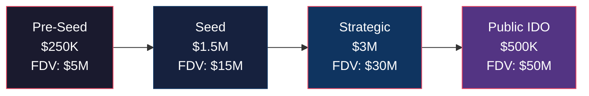

# ModernTensor — BD, Marketing & Fundraising Strategy

> **"Trust Layer for Autonomous Agents"** — Go-to-Market Plan
> Updated: Feb 2026

---

## Part 1: Business Development (BD) Strategy

### Phase 1: Foundation (Month 1-3) — "Win & Validate"

| Action | Target | KPI |
|--------|--------|-----|
| 🏆 Win Hedera Hackathon | Apex 2026 Prize | Top 3 placement |
| 🤝 Hedera Grant Application | HBAR Foundation | $50K-$100K grant |
| 📢 Announce on Twitter/X | Crypto AI community | 1K followers |
| 🎥 Demo Video | YouTube + Twitter | 10K views |

**Key Partnerships to Pursue:**

| Partner | Value | Approach |
|---------|-------|----------|
| **HBAR Foundation** | Grants + mentorship | Apply via official portal post-hackathon |
| **Hedera Accelerator** | Ecosystem support | Direct intro from hackathon mentors |
| **OpenConvAI** | Agent framework integration | Tech integration proposal |
| **HashPack / Blade Wallet** | MDT wallet support | Token listing request |

### Phase 2: Growth (Month 4-9) — "Build Trust, Build Community"

| Action | Target | KPI |
|--------|--------|-----|
| Launch Testnet with 5 Community Subnets | Dev community | 50 active miners |
| Integrate with 3 AI Agent frameworks | OpenClaw, CrewAI, AutoGen | 3 integrations live |
| Security Audit (CertiK/Trail of Bits) | Investor confidence | Audit report published |
| First Enterprise Pilot | DAO / DeFi Protocol | 1 paying customer |

**Enterprise BD Targets:**

| Vertical | Problem We Solve | Target Clients |
|----------|-----------------|----------------|
| **DeFi Protocols** | Verify AI trading agents before deployment | Aave, Compound, Uniswap forks |
| **DAO Tooling** | Audit AI governance proposals | Aragon, Snapshot |
| **AI Agent Platforms** | Trust certification for agents | OpenClaw, Fetch.ai, Autonolas |
| **Security Firms** | Automated smart contract auditing | CertiK, OpenZeppelin |

### Phase 3: Scale (Month 10-18) — "Protocol Revenue"

| Action | Target | KPI |
|--------|--------|-----|
| Mainnet Launch | Hedera Mainnet | 100+ validators |
| TGE (Token Generation Event) | CEX/DEX listing | $5M+ trading volume |
| 10 Active Subnets | Community-built | $50K monthly volume |
| Cross-chain expansion | EVM bridge (Polygon/Base) | 2 additional chains |

---

## Part 2: Marketing Strategy

### Brand Positioning

```
ModernTensor = "The Trust Layer for AI Agents"

Tagline: "Before you trust an agent with your money, trust ModernTensor first."
```

### Marketing Channels

| Channel | Strategy | Budget |
|---------|----------|--------|
| **Twitter/X** | Daily insights on Agentic AI safety, thread launches, memes | $500/mo |
| **Discord** | Community hub, developer support, subnet builder program | $200/mo |
| **YouTube** | Weekly "Agent Trust Report" + technical demos | $300/mo |
| **Blog/Mirror** | Deep-dive articles on PoI, tokenomics, architecture | $0 (team) |
| **Hackathons** | Sponsor "Build on ModernTensor" bounties | $2K/event |
| **Podcasts** | Guest on Bankless, Unchained, Web3 AI shows | $0 (earned) |
| **KOL/Influencer** | 3-5 crypto AI influencers for launch amplification | $3K total |

### Content Calendar (First 90 Days)

| Week | Content | Platform |
|------|---------|----------|
| 1 | "We Won Hedera Hackathon" announcement | Twitter, Discord |
| 2 | "Why AI Agents Need a Trust Layer" (Thread) | Twitter |
| 3 | Technical deep-dive: Proof of Intelligence | Mirror/Blog |
| 4 | Demo video: Agent Verification in 60 seconds | YouTube, Twitter |
| 5 | Tokenomics reveal (MDT) | Twitter, Discord |
| 6 | "Agent Trust Report #1" — Weekly security insights | YouTube |
| 7 | Partnership announcement (Hedera Grant) | All channels |
| 8 | Community AMA | Twitter Spaces |
| 9-12 | Developer onboarding series: "Build Your First Subnet" | Blog, YouTube |

### Community Building

| Program | Description | Incentive |
|---------|-------------|-----------|
| **Subnet Builder Program** | First 10 community subnets get grants | 50K MDT each |
| **Ambassador Program** | Regional community leaders | 10K MDT/quarter |
| **Bug Bounty** | Security vulnerability reports | Up to 100K MDT |
| **Content Creator Fund** | Tutorials, guides, reviews | 5K MDT per piece |

---

## Part 3: Fundraising Strategy

### Round Structure



### Round Details

| Round | Raise | Valuation (FDV) | Token Price | % Sold | Vesting |
|-------|-------|-----------------|-------------|--------|---------|
| **Pre-Seed** | $250K | $5M | $0.005 | 5% | 12mo cliff, 24mo linear |
| **Seed** | $1.5M | $15M | $0.015 | 10% | 12mo cliff, 24mo linear |
| **Strategic** | $3M | $30M | $0.03 | 8% | 6mo cliff, 18mo linear |
| **Public (IDO)** | $500K | $50M | $0.05 | 1% | 10% TGE, 6mo linear |
| **Total Raised** | **$5.25M** | | | **24%** | |

### Target Investors

| Tier | Investors | Check Size | What They Bring |
|------|-----------|------------|-----------------|
| **Tier 1 (Lead)** | Pantera, Polychain, a16z crypto | $500K-$2M | Brand, network, follow-on |
| **Tier 2 (Strategic)** | HBAR Foundation, Hashgraph Association | $200K-$500K | Ecosystem support |
| **Tier 3 (AI-focused)** | AI Alliance Fund, Delphi Ventures | $100K-$300K | AI domain expertise |
| **Tier 4 (Angels)** | AI researchers, Hedera devs | $10K-$50K | Technical credibility |

### Investor Pitch Framework (NABC)

```
NEED:     AI Agents are handling $50B+ in transactions.
          Who verifies they're not hallucinating or malicious?

APPROACH: ModernTensor — Proof of Intelligence protocol on Hedera.
          Benchmark + Validate + Log Trust on-chain.

BENEFIT:  Every AI agent interaction generates MDT fees.
          $12B TAM, we need only 0.1% = $12M ARR.

COMPETITION: Bittensor (no trust layer), Fetch.ai (no verification).
             We're the ONLY "AI Trust Protocol" on any chain.
```

### Use of Funds

| Category | % | Amount | Purpose |
|----------|---|--------|---------|
| **Engineering** | 45% | $2.36M | Core protocol, SDKs, integrations |
| **BD & Partnerships** | 20% | $1.05M | Enterprise pilots, ecosystem deals |
| **Marketing & Community** | 15% | $787K | Brand, content, KOLs, events |
| **Operations & Legal** | 10% | $525K | Compliance, token legal, team ops |
| **Security & Audits** | 10% | $525K | Smart contract audits, bug bounties |

---

## Part 4: Making MDT Valuable — The "Must-Have" Playbook

### Strategy 1: Demand Drivers (Why People MUST Buy MDT)

| Driver | Mechanism |
|--------|-----------|
| **Validator Staking** | Must stake 50K MDT to run a Trust Node |
| **Agent Bonding** | Every AI Agent must deposit 1K MDT as guarantee |
| **Subnet Creation** | Must lock/burn 10K MDT to create a subnet |
| **Task Payments** | All payments denominated in MDT |
| **Governance** | Vote on parameters requires MDT |

### Strategy 2: Supply Reducers (Why MDT Becomes Scarcer)

| Reducer | Impact |
|---------|--------|
| **Fee Burns** | 50% of protocol fees permanently burned |
| **Slash Burns** | 100% of slashed stakes burned |
| **Subnet Burns** | 20% of registration fee burned |
| **Badge Renewals** | Annual 100 MDT burned per agent |
| **Vesting Locks** | 76% of supply locked at TGE |

### Strategy 3: Network Effects

```
More Agents → More Verification Demand → More MDT Staked
                     ↓
More Subnets → More Use Cases → More MDT Burned
                     ↓
Higher MDT Price → More Validators Join → Better Security
                     ↓
        Enterprise Adoption → Massive Volume → Protocol Revenue
```

---

## Part 5: Key Milestones & Timeline

| Date | Milestone | Impact on Token |
|------|-----------|-----------------|
| **Feb 2026** | Hackathon submission | Validation & PR |
| **Mar 2026** | HBAR Foundation Grant | Runway + credibility |
| **Apr 2026** | Pre-Seed close ($250K) | 18mo runway |
| **Jun 2026** | Testnet v2 + 5 subnets | Usage metrics for Seed |
| **Aug 2026** | Seed round ($1.5M) | Scale engineering |
| **Oct 2026** | Security audit complete | Investor confidence |
| **Dec 2026** | Strategic round ($3M) | Pre-launch momentum |
| **Q1 2027** | Mainnet + TGE | MDT goes live |
| **Q2 2027** | First CEX listing | Liquidity |
| **Q3 2027** | 10 active subnets | Protocol revenue |

---

> [!IMPORTANT]
> **The #1 rule of making a token valuable: Create a situation where people NEED to buy it, not just WANT to.** MDT achieves this through mandatory staking (validators), mandatory bonding (agents), and mandatory payment (all tasks). Combined with continuous burns, this creates structural demand that exceeds supply reduction over time.
