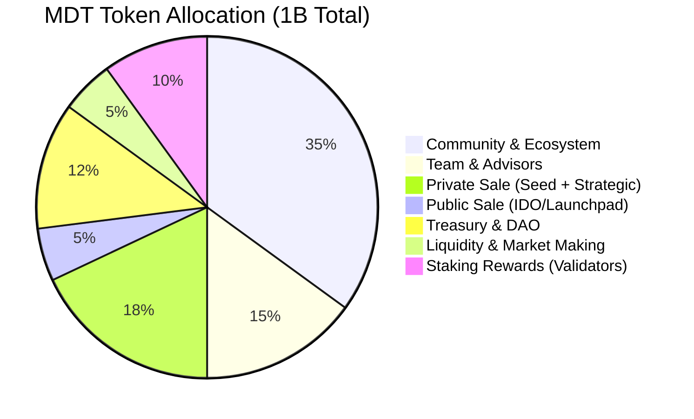
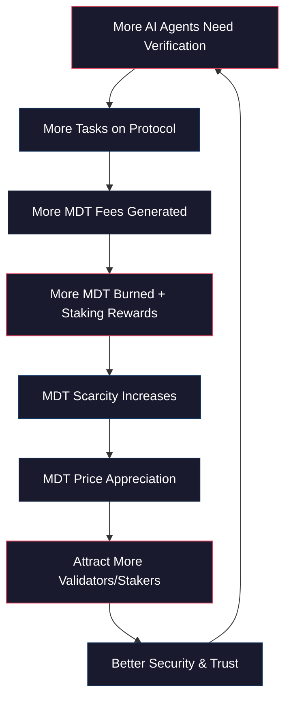

# ModernTensor (MDT) — Tokenomics Design

> **Version 2.0** — "Trust Layer for Autonomous Agents" Narrative
> Updated: Feb 2026

---

## 1. Token Overview

| Parameter | Value |
|-----------|-------|
| **Token Name** | ModernTensor |
| **Ticker** | MDT |
| **Standard** | HTS (Hedera Token Service) — Fungible |
| **Max Supply** | 1,000,000,000 MDT (1 Billion) |
| **Initial Circulating** | 80,000,000 MDT (8%) |
| **Decimals** | 8 |
| **Network** | Hedera Hashgraph |

---

## 2. Token Allocation



| Category | % | Amount | Vesting |
|----------|---|--------|---------|
| **Community & Ecosystem** | 35% | 350M | 4-year linear, 6mo cliff |
| **Team & Advisors** | 15% | 150M | 4-year linear, 12mo cliff |
| **Private Sale (Seed)** | 10% | 100M | 12mo cliff, 24mo linear |
| **Private Sale (Strategic)** | 8% | 80M | 6mo cliff, 18mo linear |
| **Public Sale (IDO)** | 5% | 50M | 10% TGE, 6mo linear |
| **Treasury/DAO** | 12% | 120M | Governed by DAO vote |
| **Liquidity & MM** | 5% | 50M | 20% TGE, 12mo linear |
| **Staking Rewards** | 10% | 100M | Emitted over 4 years (halving) |

---

## 3. Token Utility — 5 Pillars

### Pillar 1: 🔐 Staking & Security (Validator Bond)

| Role | Min Stake | Purpose |
|------|-----------|---------|
| **Trust Node (Validator)** | 50,000 MDT | Run PoI verification, earn fees |
| **Subnet Owner** | 10,000 MDT | Register & operate a subnet |
| **Agent Bond** | 1,000 MDT | AI Agent deposits as "good behavior" guarantee |

- **Slashing**: Malicious validators lose 10% stake → Burned
- **Agent Penalty**: Failed verification = 5% bond burn

### Pillar 2: 💸 Payment & Fees

```
Task Reward Flow:
User pays 100 MDT for Code Review task
├── 1% → Protocol Treasury (1 MDT)          [BURNED or DAO]
├── 3% → Subnet Owner (3 MDT)               [Subnet #1 fee]
├── 5% → Validator Pool (5 MDT)             [Trust Nodes]
└── 91% → Winning Miner (91 MDT)            [Best performer]
```

### Pillar 3: 🏛️ Governance (DAO Voting)

| Action | Required |
|--------|----------|
| Protocol parameter changes | 10,000 MDT + vote |
| New subnet approval | 5,000 MDT stake |
| Fee structure updates | DAO majority vote |
| Treasury spending | DAO supermajority (67%) |

### Pillar 4: 🏅 Reputation & Badges

- **Verified Agent Badge**: Earned through PoI verification → Recorded on HCS
- **Badge Cost**: Gas only (HCS message ~$0.0001)
- **Badge Revocation**: If agent reputation drops below threshold → Stake slashed

### Pillar 5: 🔥 Deflationary Mechanisms

| Mechanism | Burn Rate | Trigger |
|-----------|-----------|---------|
| Protocol Fee Burn | 50% of 1% fee | Every task completion |
| Subnet Registration | 20% of 10K MDT | New subnet creation |
| Slash Events | 100% of slashed amount | Malicious behavior |
| Badge Renewal | 100 MDT/year | Annual re-verification |

**Projected Annual Burn**: ~2-5% of circulating supply

---

## 4. Emission Schedule (Staking Rewards)

| Year | Daily Emission | Annual | Cumulative |
|------|---------------|--------|------------|
| **Year 1** | 68,493 MDT | 25M MDT | 25M |
| **Year 2** | 68,493 MDT | 25M MDT | 50M |
| **Year 3** (Halving) | 34,247 MDT | 12.5M MDT | 62.5M |
| **Year 4** | 34,247 MDT | 12.5M MDT | 75M |
| **Year 5+** | Community governed | DAO vote | DAO vote |

> Modeled after Bitcoin/Bittensor halving schedule for predictable scarcity.

---

## 5. Value Accrual Flywheel



**Key Insight**: Unlike pure "pay-for-compute" tokens, MDT is a **"trust premium" token** — its value comes from the trust it provides, not just compute cycles.

---

## 6. Competitive Tokenomics Comparison

| Feature | MDT (ModernTensor) | TAO (Bittensor) | FET (Fetch.ai) |
|---------|-------------------|-----------------|----------------|
| Max Supply | 1B | 21M | 1.15B |
| Burn Mechanism | ✅ Multi-layer | ❌ None | ❌ None |
| Staking Utility | Bond + Validate + Govern | Stake for subnet emissions | Passive staking |
| Agent Bonding | ✅ (Unique) | ❌ | ❌ |
| Subnet Registration Burn | ✅ 2,000 MDT burned | ❌ | N/A |
| Revenue Sharing | ✅ Validators earn fees | ✅ Emission-based | ❌ |
| Halving Schedule | ✅ Year 3 | ✅ Year 4 | ❌ |

---

## 7. Token Price Scenarios (Post-TGE)

> [!CAUTION]
> These are hypothetical models only, not financial advice.

| Scenario | FDV at TGE | MDT Price | Circulating MC |
|----------|-----------|-----------|----------------|
| **Conservative** | $5M | $0.005 | $400K |
| **Base** | $15M | $0.015 | $1.2M |
| **Bullish** | $50M | $0.05 | $4M |

Comparable projects at similar stage: Morpheus ($25M FDV at launch), Ritual ($30M), Sahara AI ($43M).
